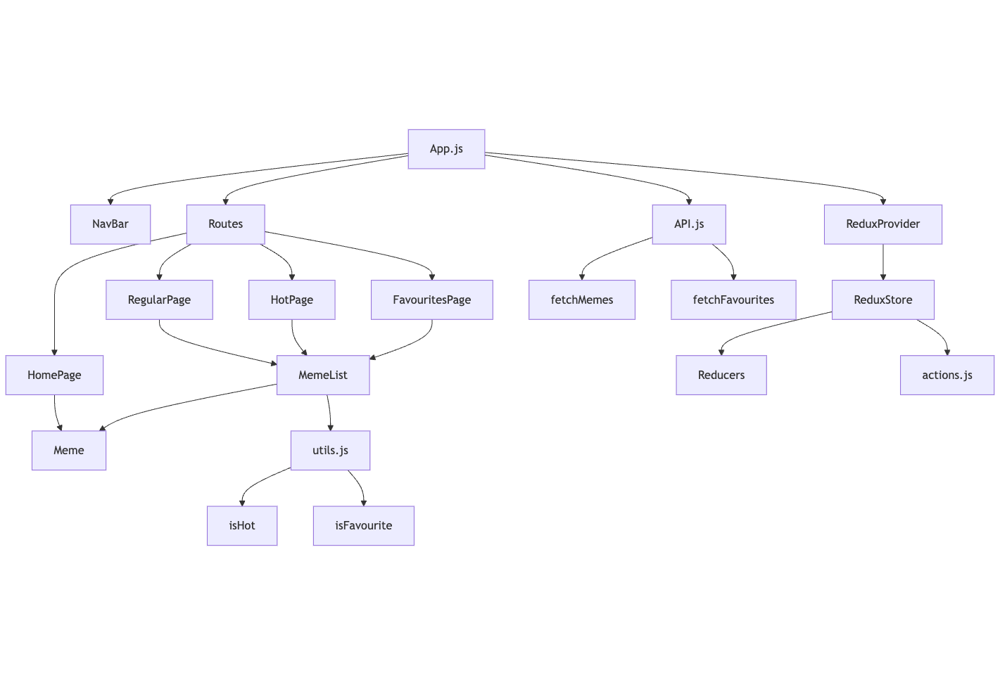

# Mem Serwis

**Mem Serwis** to aplikacja internetowa umożliwiająca przeglądanie i zarządzanie memami. Użytkownicy mogą przeglądać różne kategorie memów, dodawać je do ulubionych oraz wyświetlać losowy mem na stronie głównej.

## Podstrony

- **Home (`/`)**: Wyświetla losowo wybrany mem przy każdym odświeżeniu strony, lub zagłosowaniu. 
- **Hot Memes (`/hot`)**: Lista memów oznaczonych jako "hot".
- **Regular Memes (`/regular`)**: Lista standardowych memów, nieoznaczonych jako "hot".
- **Favourites (`/favourite`)**: Lista memów dodanych do ulubionych przez pojedyńczego użytkownika.

## Technologie

- **React**: Biblioteka JavaScript do budowy interfejsu użytkownika.
- **Redux**: Zarządzanie stanem aplikacji.
- **React Router**: Nawigacja między podstronami aplikacji.
- **AWS S3**: Hosting statycznych plików aplikacji.

## Architektura projektu

- **App.js**: Główny komponent zarządzający nawigacją i stanem aplikacji.
- **NavBar**: Pasek nawigacyjny z odnośnikami do poszczególnych podstron.
- **Routes**: Definicje URLi w aplikacji, kierujące do odpowiednich komponentów stron.
- **HomePage**: Wyświetla losowy mem.
- **MemeList**: Lista memów dla poszczególnych kategorii.
- **Meme**: Komponent prezentujący pojedynczy mem.


Poniżej znajduje się diagram architektury projektu:



Dane o memach są przechowywane w statycznych plikach JSON i zarządzane za pomocą Redux. 

- **/data/memes.json**: Lista wszystkich memów dostępnych a stronie.
- **/data/favourites.json**: Lista ulubionych memów (po id), dla danego użytkownika.

## On-line

Aktualna wersja dostępna jest on-line pod adresem: [meme-service.s3-website.eu-central-1.amazonaws.com](http://meme-service.s3-website.eu-central-1.amazonaws.com/).

## Instalacja i uruchomienie

1. Sklonuj repozytorium:
   ```bash
    git clone https://github.com/zinit/mem-serwis.git
    
2. Przejdź do katalogu projektu:
   ```bash
    cd mem-serwis

3. Zainstaluj zależności:
   ```bash
    npm install

4. Uruchom aplikację:
   ```bash
    npm start

Aplikacja będzie dostępna pod adresem http://localhost:3000.
